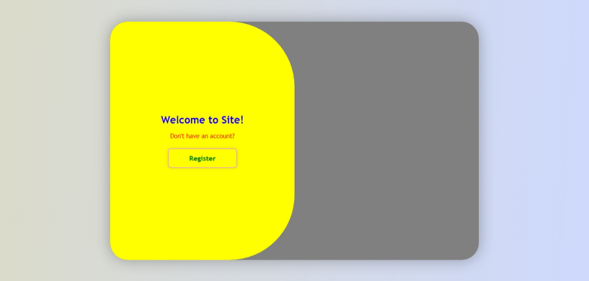
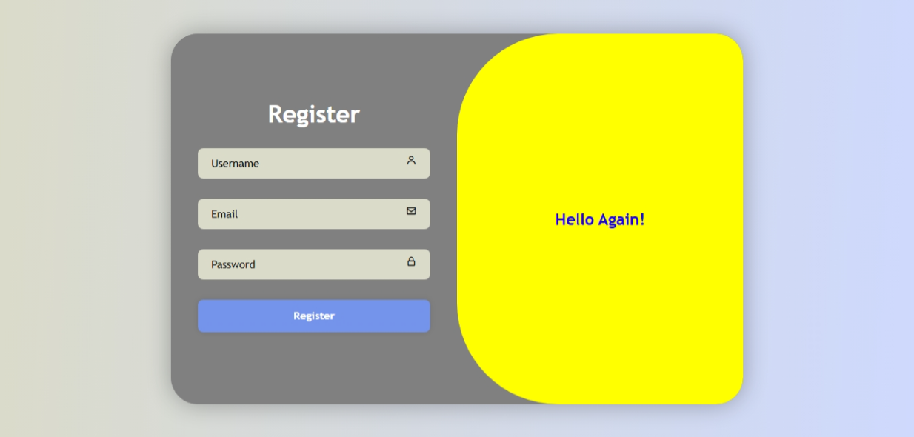

# 🔐 Registeration Authentication UI

This is a stylish **Register Form** built using **HTML**, **CSS**, and **JavaScript**.  
It features a modern sliding animation between login and register panels with toggle functionality.

---

## ✨ Features

- Sliding animated transition for Register forms.
- Clean UI with icon support (via [Boxicons](https://boxicons.com/)).
- Responsive and smooth design.
- Password/email input with validation and icons.

---

## 📸 Screenshots

| Register Panel |
|-------------|----------------|
|  |  |

---

## 🚀 Live Demo

👉 [Click here to view the Live Project](https://msdhinesh45.github.io/form-animation/)  

---

## 💡 How It Works

- The toggle panel slides based on the button clicked (`Register`).
- Fully styled using external CSS with modern gradients, shadows, and layout structure.

---

## 🧱 Built With

- HTML5
- CSS3 (with gradients, flexbox, animation)
- JavaScript (DOM manipulation, event listeners)
- Boxicons CDN for icons

---

## 🧑‍💻 Author

- **Name**: Dhinesh Kumar
- **Role**: Frontend Developer
- **GitHub**: [@msdhinesh45](https://github.com/msdhinesh45)

---

